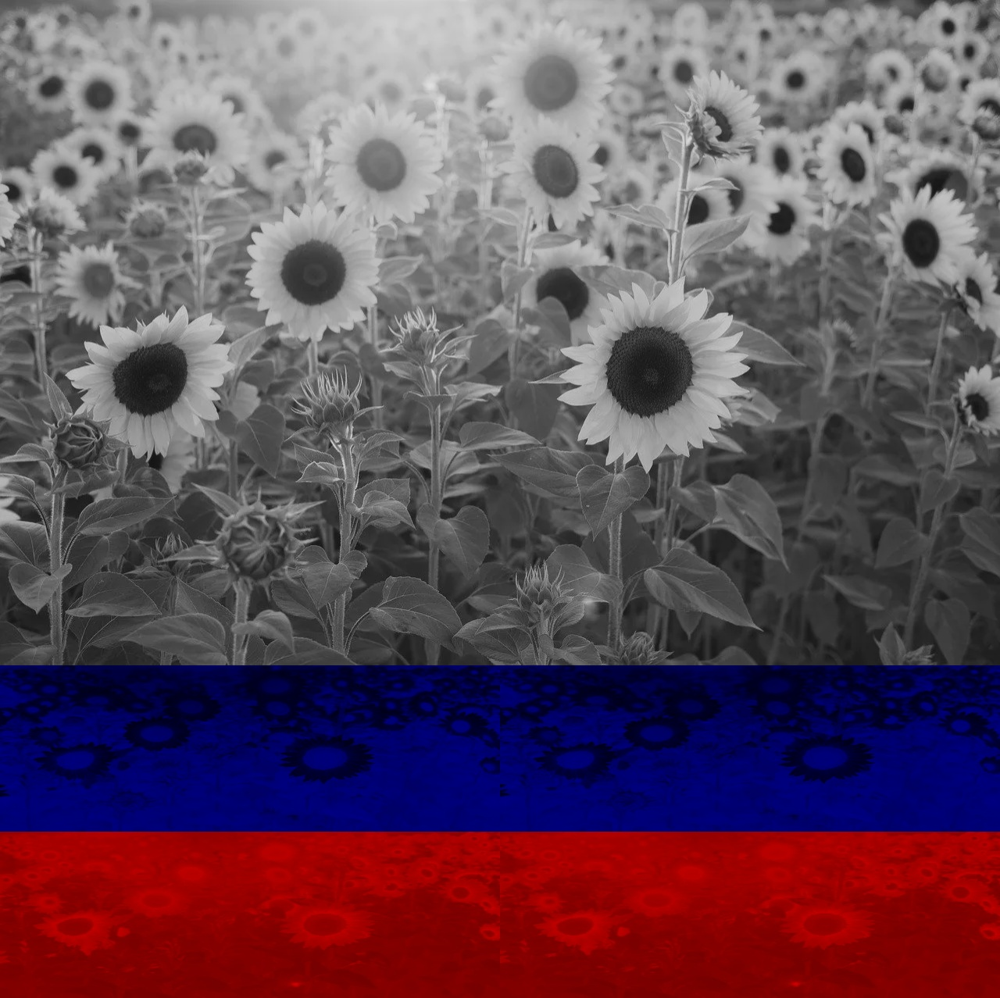
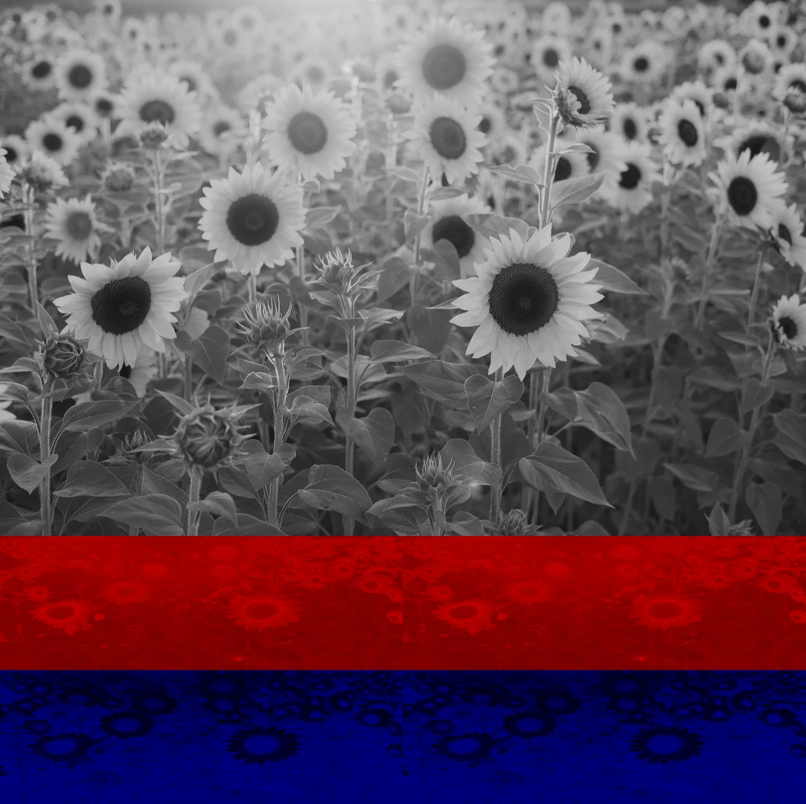
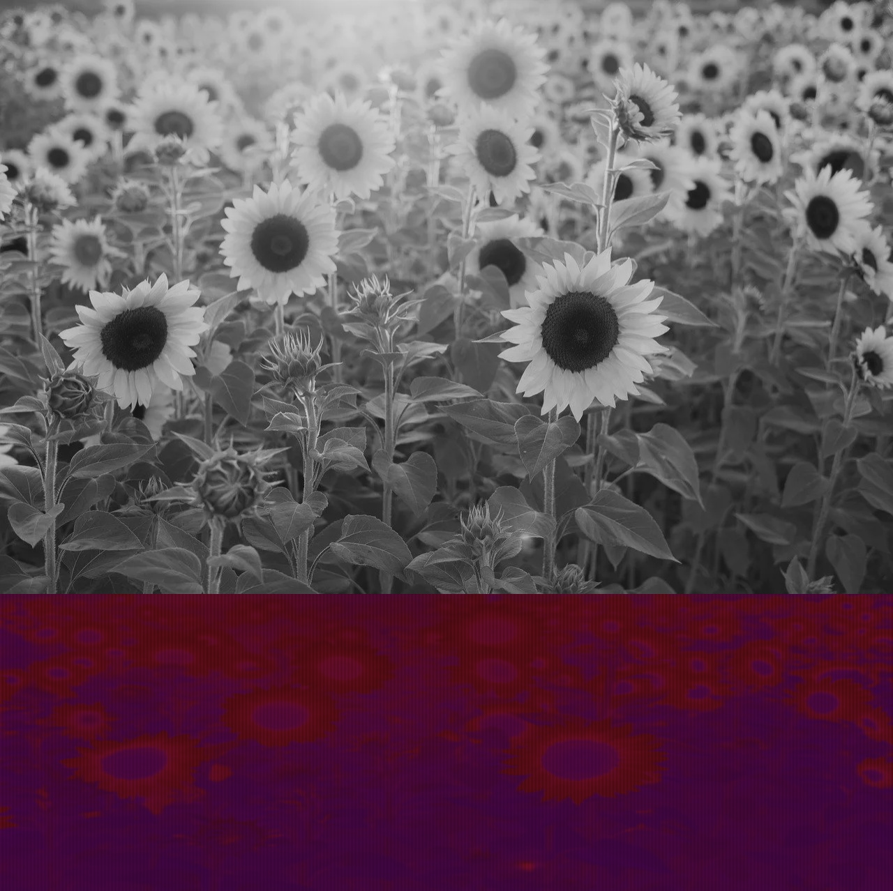
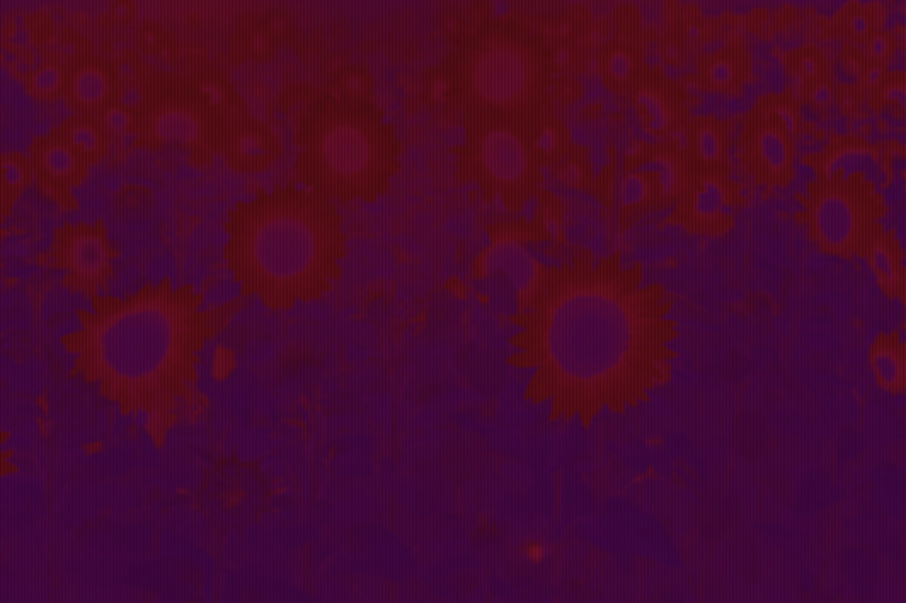
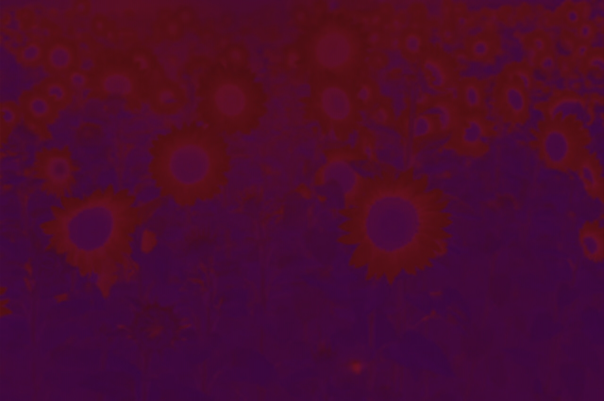
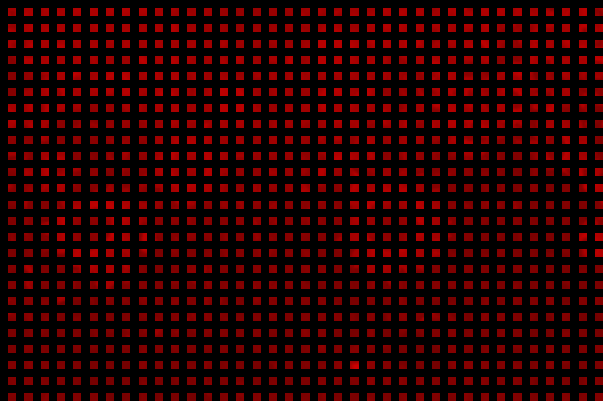
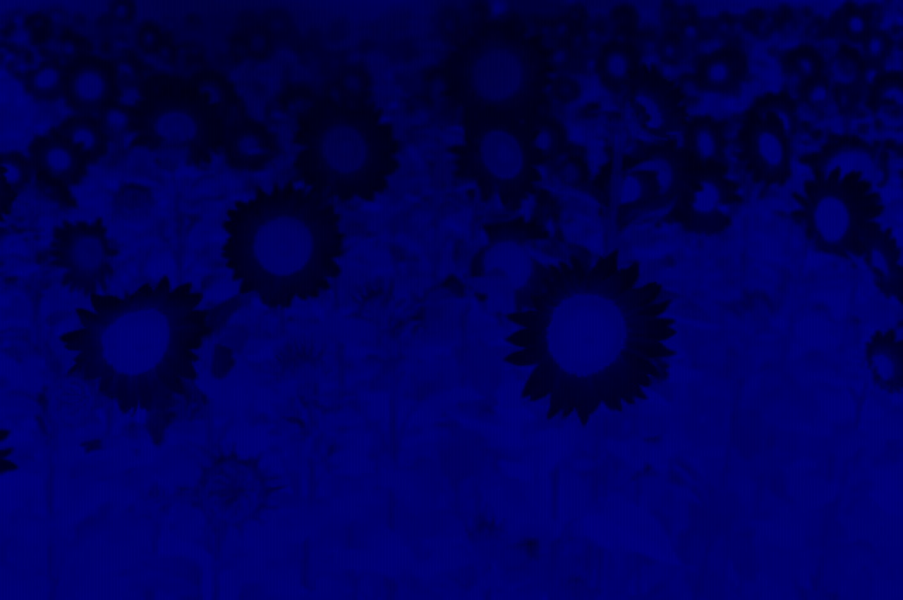
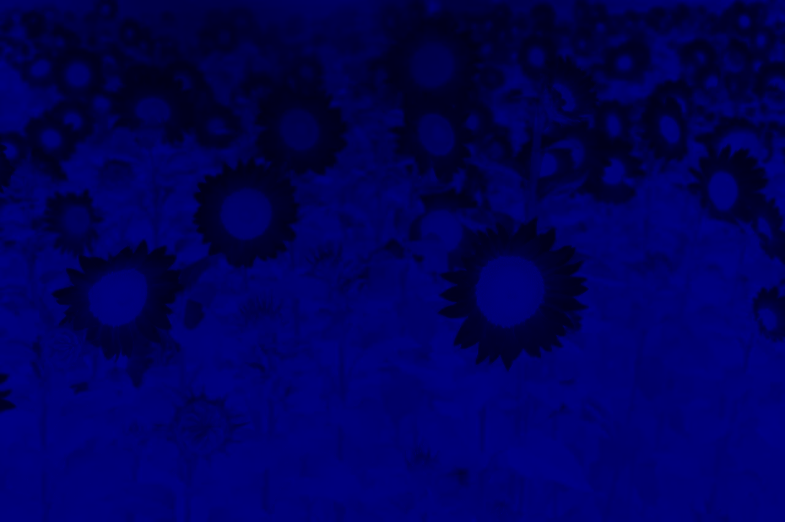
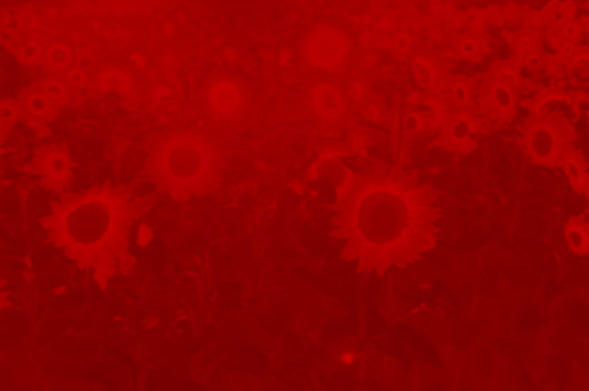

# rgb_yuv_NV12_NV21_I420_YV12_YUYV

## can get the same result with opencv

Y: luminance; UV: chrominance, U (blue projection) and V (red projection)

YUV to RGB, RGB to YUV, save to binary file, save colorful picture, more details can see my blog below.

## Converting formula
the converting formula in yuv2rgb and rgb2yuv is the same with opencv
```Python3 []
# rgb2yuv
Y[h, w] = round( 0.257 * R + 0.504 * G + 0.098 * B) + 16
U[h, w] = round(-0.148 * R - 0.291 * G + 0.439 * B) + 128   # blue projection
V[h, w] = round( 0.439 * R - 0.368 * G - 0.071 * B) + 128    # red projection

# yuv2rgb
y, u, v = Y[h, w], U[h, w], V[h, w]
y = max(0, y - 16)
u = u - 128
v = v - 128
R = 1.164 * y + 1.596 * v
G = 1.164 * y - 0.813 * v - 0.391 * u
B = 1.164 * y + 2.018 * u
imgnow[h, w, :] = [B, G, R]
```

[cv2.cvtColor](https://docs.opencv.org/4.9.0/d8/d01/group__imgproc__color__conversions.html#ga397ae87e1288a81d2363b61574eb8cab) can be used directly in this program's result like I420, NV12/NV21, UYVY, YUY2, YVYU and so on.

```Python3 []
I422_, UYVY_plane, YUY2_plane, YVYU_plane, UYVY, YUY2, YVYU, NV16, NV61 = rgb2yuv422()
recover_UYVY = cv2.cvtColor(UYVY, cv2.COLOR_YUV2BGR_UYVY)
recover_YUY2 = cv2.cvtColor(YUY2, cv2.COLOR_YUV2BGR_YUY2)
recover_YVYU = cv2.cvtColor(YVYU, cv2.COLOR_YUV2BGR_YVYU)

...
I420_YV12_tuple, I420, YV12, NV12, NV21 = rgb2yuv420()
recover12 = cv2.cvtColor(gray_12, cv2.COLOR_YUV2BGR_NV12)
recover21 = cv2.cvtColor(gray_21, cv2.COLOR_YUV2BGR_NV21)
recover_I420 = cv2.cvtColor(I420, cv2.COLOR_YUV2BGR_I420)
recover_YV12 = cv2.cvtColor(YV12, cv2.COLOR_YUV2BGR_YV12)
```

### binary file NV12/NV21 to gray image and convert to rgb
```Python3 []
def create_fromNV12_NV21_420():
    nv12pth = os.path.join(abspath, 'NV12.bin')
    nv21pth = os.path.join(abspath, 'NV21.bin')
    
    nv12 = np.fromfile(nv12pth, dtype=np.uint8)
    nv21 = np.fromfile(nv21pth, dtype=np.uint8)
    
    nv12_img = np.zeros((height//2*3, width, 3), dtype=np.uint8)
    nv21_img = nv12_img.copy()
    Y_12 = nv12[:height * width].reshape((height, width))
    UV_12 = nv12[height*width:].reshape((height//2, width))
    gray_12 = np.concatenate([Y_12, UV_12], axis = 0)
    
    Y_21 = nv21[:height * width].reshape((height, width))
    VU_21 = nv21[height*width:].reshape((height//2, width))
    gray_21 = np.concatenate([Y_21, VU_21], axis = 0)
    
    nv12_img[:height, :, :] = np.stack([Y_12, Y_12, Y_12], axis = 2)
    nv21_img[:height, :, :] = np.stack([Y_21, Y_21, Y_21], axis = 2)
    
    for h in range(height, height//2*3):
        hi = h - height
        for w in range(0, width, 2):
            nv12_img[h, w, 0] = UV_12[hi, w]
            nv12_img[h, w+1, 2] = UV_12[hi, w+1]
            nv21_img[h, w, 2] = VU_21[hi, w]
            nv21_img[h, w+1, 0] = VU_21[hi, w+1]

    cv2.imwrite(os.path.join(savepath, '420_NV12.jpg'), nv12_img)
    cv2.imwrite(os.path.join(savepath, '420_NV21.jpg'), nv21_img)
    return gray_12, gray_21

gray_12, gray_21 = create_fromNV12_NV21_420()
# https://github.com/opencv/opencv/blob/4.x/modules/imgproc/test/test_cvtyuv.cpp
recover12 = cv2.cvtColor(gray_12, cv2.COLOR_YUV2BGR_NV12)
recover21 = cv2.cvtColor(gray_21, cv2.COLOR_YUV2BGR_NV21)
```

firstly you convert Rgb to yuv444, then you convert yuv444 to rgb'. Is the rgb' the same with Rgb, the answer is no. because some value will > 255 or < 0 during converting, and you need to truncate it to [0, 255]. So some information is lost.

## rgb2yuv422 is a little different
you need calculate the average UV in two pixels. It is different to rgb2yuv420 and rgb2yuv444.
```Python3 []
for h in range(height):
    for w in range(0, width, 2):
        R, G, B = img[h, w, :]
        Rn, Gn, Bn = img[h, w + 1, :]
        Y[h, w] = round(0.257 * R + 0.504 * G + 0.098 * B + 16)
        Y[h, w + 1] = round(0.257 * Rn + 0.504 * Gn + 0.098 * Bn + 16)
        U[h, w, 0] = round(-0.148 * (R + Rn) / 2.0 - 0.291 * (G + Gn) / 2.0 + 0.439 * (B + Bn) / 2.0 + 128.0)   # blue projection
        V[h, w, 2] = round(0.439 * (R + Rn) / 2.0 - 0.368 * (G + Gn) / 2.0 - 0.071 * (B + Bn) / 2.0 + 128.0)    # red projection
```

## I420 YV12 
**format I420**
```Text []
Y
U U
V V
```

**format YV12**
```Text []
Y
V V
U U
```

YUV image for 420_I420 and 420_YV12
 

## NV12/NV21
**format NV12**
```Text []
Y
UVUVUVUV...
UVUVUVUV...
```

**format NV21**
```Text []
Y
VUVUVUVU...
VUVUVUVU...
```

YUV image for 420_NV12 and 420_NV21
 

## UYVY, YUY2, YVYU
**format UYVY**
```Text []
channel 0
UVUVUVUV...
UVUVUVUV...
channel 1
YYYYYYYYY...
YYYYYYYYY...
```

**format YUY2**
```Text []
channel 0
YYYYYYYYY...
YYYYYYYYY...
channel 1
UVUVUVUV...
UVUVUVUV...
```

**format YVYU**
```Text []
channel 0
YYYYYYYYY...
YYYYYYYYY...
channel 1
VUVUVUVU...
VUVUVUVU...
```

UV channel from UYVY, YUY2 and YVYU, left is UV, right is VU.
 

### converted yuv420 U, V picture with 0 to fill
some grid is 0, which has no UV value. For a 2x2 grid, just (0, 0) has UV, (0,1), (1, 0), (1, 1) have no UV value.

 

### converted yuv422 U, V picture with 0 to fill
vertical black line is 0，which has no UV value.

 

### converted yuv444 U, V picture with 0 to fill
 

## version

numpy==1.21.0

opencv-python==4.9.0

## blogs

[yuv转rgb,420,422,NV12, NV21,I420,YV12,YVYU,YUY2,UYVY, NV16, NV61,NV24, NV42,888,101010图像视频格式](https://zhuanlan.zhihu.com/p/695302926)

[yuv转rgb,420,422,NV12, NV21,I420,YV12,YVYU,YUY2,UYVY](https://blog.csdn.net/m0_50617544/article/details/138358293?csdn_share_tail=%7B%22type%22%3A%22blog%22%2C%22rType%22%3A%22article%22%2C%22rId%22%3A%22138358293%22%2C%22source%22%3A%22m0_50617544%22%7D)

## Reference

[https://video.matrox.com/en/media/guides-articles/introduction-color-spaces-video](https://video.matrox.com/en/media/guides-articles/introduction-color-spaces-video)

[https://wiki.videolan.org/YUV/](https://wiki.videolan.org/YUV/)

[https://github.com/opencv/opencv/blob/4.x](https://github.com/opencv/opencv/blob/4.x/modules/imgproc/test/test_cvtyuv.cpp)

[https://docs.opencv.org](https://docs.opencv.org/4.9.0)

[https://fourcc.org/yuv.php#UYVY](https://fourcc.org/yuv.php#UYVY)

[https://fourcc.org/fccyvrgb.php](https://fourcc.org/fccyvrgb.php)
